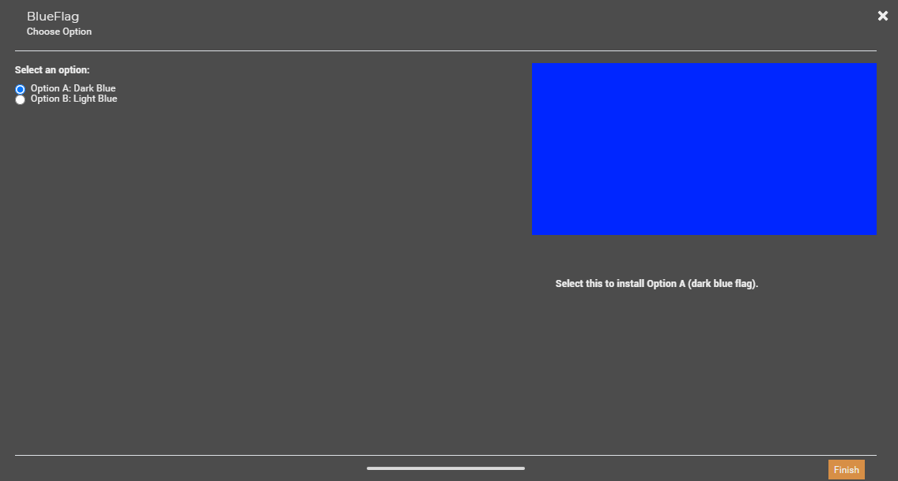

# Custom mod installer examples for GROUND BRANCH

FOMOD is an XML format for creating mod installers.

See the following pages for details:

- https://wiki.nexusmods.com/index.php/How_to_create_mod_installers
- https://fomod-docs.readthedocs.io/en/latest/index.html

## Example 1: mod-red-flag-fomod

We have the file `Red.png` and want to install it as
``GroundBranch\Content\GroundBranch\Patches\Role\(JaneDoe)Red.png``

We have the following files:
- example-mod-red-flag-fomod/fomod/info.xml
- example-mod-red-flag-fomod/fomod/ModuleConfig.xml
- example-mod-red-flag-fomod/Red.png (MD5SUM `a430cbd3853ce0bba7156255f24d1237`)


General metadata: `fomod/info.xml`

````xml
<fomod>
    <Name>Red patch</Name>
    <Author>JaneDoe</Author>
    <Version>0.0.1</Version>
    <Website>https://nexusmods.com/groundbranch/mods/INSERT_MOD_ID/</Website>
    <Description>A red patch.</Description>
    <Groups>
        <element>Visuals and Graphics</element>
    </Groups>
</fomod>
````

Installer instructions: `fomod/ModuleConfig.xml`

````xml
<config xmlns:xsi="http://www.w3.org/2001/XMLSchema-instance" xsi:noNamespaceSchemaLocation="http://qconsulting.ca/fo3/ModConfig5.0.xsd"> 
    <moduleName>RedFlag</moduleName> 
    <requiredInstallFiles> 
        <file source="Red.png" destination="GroundBranch\Content\GroundBranch\Patches\Role\(JaneDoe)Red.png" />
    </requiredInstallFiles> 
</config>
````

We can ZIP the `example-mod-red-flag` folder and then use Vortex menu item "Install from file" to test the installation.

If we right-click and select "Generate Report" -> "Save to file", we get the following report. The report shows us that the file was deployed correctly.

````
*** Vortex mod report for: example-mod-red-flag.zip
<This report was automatically generated by Vortex using the information from the reporter's installation, including any alterations - intentional or otherwise - they may have made to the data.>
**************************************************
* Mod details
**************************************************
Mod name: example-mod-red-flag.zip
Version: N/A
Archive: N/A
Mod type: default
Managed game: groundbranch
[...]

**************************************************
* Deployed files
**************************************************
GroundBranch\Content\GroundBranch\Patches\Role\(JaneDoe)Red.png (a430cbd3853ce0bba7156255f24d1237)

**************************************************
* Files overwritten by other mod
**************************************************
<None>

**************************************************
* Files not deployed
**************************************************
<None>

**************************************************
* Files that are supposed to be deployed but weren't found
**************************************************
<None>

**************************************************
* Files that are present but couldn't be read
**************************************************
<None>
````
## Alternative

We can provide a ZIP file with correct layout and the [Vortex GROUND BRANCH extension](https://www.nexusmods.com/site/mods/412) will deploy the file correctly for us.
Rename `example-mod-red-flag-fomod/Red.png` into ``example-mod-red-flag-simple\Content\GroundBranch\Patches\Role\(JaneDoe)Red.png``

When we create a ZIP file from the new directory and install it using Vortex we will see in the report that the file was deployed correctly.

````
*** Vortex mod report for: example-mod-red-flag-simple.zip
<This report was automatically generated by Vortex using the information from the reporter's installation, including any alterations - intentional or otherwise - they may have made to the data.>
**************************************************
* Mod details
**************************************************
Mod name: example-mod-red-flag-simple.zip
Version: N/A
Archive: N/A
Mod type: default
Managed game: groundbranch
[...]

**************************************************
* Deployed files
**************************************************
GroundBranch\Content\GroundBranch\Patches\Role\(JaneDoe)Red.png (a430cbd3853ce0bba7156255f24d1237)

**************************************************
* Files overwritten by other mod
**************************************************
<None>

**************************************************
* Files not deployed
**************************************************
<None>

**************************************************
* Files that are supposed to be deployed but weren't found
**************************************************
<None>

**************************************************
* Files that are present but couldn't be read
**************************************************
<None>
````

## Example 2: example-mod-blue-fomod

We have two files `LightBlue.png` and `DarkBlue.png` and want to install
one of them as ``GroundBranch\Content\GroundBranch\Patches\Role\(JaneDoe)Blue.png``

We have the following files:
- example-mod-blue-flag-fomod/fomod/info.xml
- example-mod-blue-flag-fomod/fomod/ModuleConfig.xml
- example-mod-blue-flag-fomod/DarkBlue.png (MD5SUM `5fa2ef5c8ff848c8ce112965478d8907`)
- example-mod-blue-flag-fomod/LightBlue.png (MD5SUM `1b45e2a15a10a6894d81536f50b21a8e`)

General metadata: `info.xml`

````xml
<fomod>
    <Name>Blue Flag patch with multiple options</Name>
    <Author>JaneDoe</Author>
    <Version>0.0.1</Version>
    <Website>https://nexusmods.com/groundbranch/mods/INSERT_MOD_ID/</Website>
    <Description>Installs a blue flag, but the user can decide if they want dark or light blue.</Description>
    <Groups>
        <element>Visuals and Graphics</element>
    </Groups>
</fomod> 
````

Installer instructions: `fomod/ModuleConfig.xml`

````xml
<config xmlns:xsi="http://www.w3.org/2001/XMLSchema-instance" xsi:noNamespaceSchemaLocation="http://qconsulting.ca/fo3/ModConfig5.0.xsd">
    <moduleName>BlueFlag</moduleName>
    <!--
    <requiredInstallFiles>
    </requiredInstallFiles>
    -->

    <installSteps order="Explicit">
        <installStep name="Choose Option">
            <optionalFileGroups order="Explicit">
                <group name="Select an option:" type="SelectExactlyOne">
                    <plugins order="Explicit">
                        <plugin name="Option A: Dark Blue">
                            <description>Select this to install Option A (dark blue flag).</description>
                            <image path="DarkBlue.png" />
                            <files>
                                <file source="DarkBlue.png" destination="GroundBranch\Content\GroundBranch\Patches\Role\(JaneDoe)Blue.png" priority="0" />
                            </files>
                            <typeDescriptor>
                                <type name="Recommended"/>
                            </typeDescriptor>
                        </plugin>
                        <plugin name="Option B: Light Blue">
                            <description>Select this to install Option B (light blue flag).</description>
                            <image path="LightBlue.png" />
                            <files>
                                <file source="LightBlue.png" destination="GroundBranch\Content\GroundBranch\Patches\Role\(JaneDoe)Blue.png" priority="0" />
                            </files>
                            <typeDescriptor>
                                <type name="Optional"/>
                            </typeDescriptor>
                        </plugin>
                    </plugins>
                </group>
            </optionalFileGroups>
        </installStep>
    </installSteps>
</config>
````

We can ZIP the `example-mod-blue-flag-fomo` folder and then use Vortex menu item "Install from file" to test the installation.

Vortex will display the following window:



The report will show that the file was deployed correctly:

````
**************************************************
* Deployed files
**************************************************
GroundBranch\Content\GroundBranch\Patches\Role\(JaneDoe)Blue.png (5fa2ef5c8ff848c8ce112965478d8907)
````

Note: In case we select Option B (Light blue) the MD5SUM of the `png` will obviously be `1b45e2a15a10a6894d81536f50b21a8e` in the report.

## Alternative

[Vortex GROUND BRANCH extension](https://www.nexusmods.com/site/mods/412) does not provide support for interactive dialogues, however we can create 
two ZIP files and upload them both to NexusMods:

- `blue-flag.zip` with `DarkBlue.png` renamed to `Content/GroundBranch/Patches/Role/(JaneDoe)Blue.png`
- `blue-flag-variant-lightblue.zip` with `LightBlue.png` renamed to `Content/GroundBranch/Patches/Role/(JaneDoe)Blue.png`
 
This way the user can decide which variant they want to download.

-----

# License

````
Permission to use, copy, modify, and/or distribute this software for
any purpose with or without fee is hereby granted.

THE SOFTWARE IS PROVIDED “AS IS” AND THE AUTHOR DISCLAIMS ALL
WARRANTIES WITH REGARD TO THIS SOFTWARE INCLUDING ALL IMPLIED WARRANTIES
OF MERCHANTABILITY AND FITNESS. IN NO EVENT SHALL THE AUTHOR BE LIABLE
FOR ANY SPECIAL, DIRECT, INDIRECT, OR CONSEQUENTIAL DAMAGES OR ANY
DAMAGES WHATSOEVER RESULTING FROM LOSS OF USE, DATA OR PROFITS, WHETHER IN
AN ACTION OF CONTRACT, NEGLIGENCE OR OTHER TORTIOUS ACTION, ARISING OUT
OF OR IN CONNECTION WITH THE USE OR PERFORMANCE OF THIS SOFTWARE.
````


